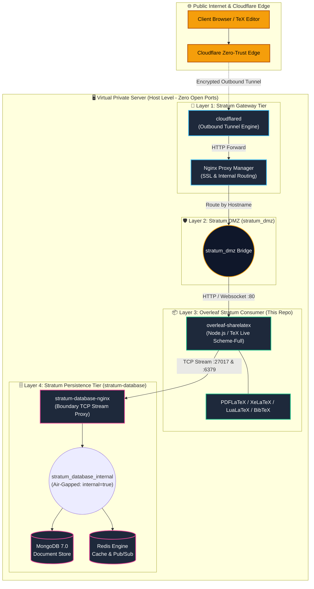
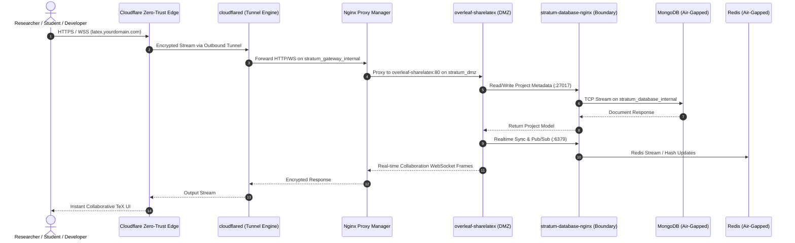

# Overleaf Community Edition — Stratum Consumer Architecture

> *"Enterprise collaborative LaTeX platform deployed under zero-trust island isolation and transversal persistence."*

[](https://github.com/overleaf/overleaf)
[](https://www.tug.org/texlive/)
[](#1-architectural-motivation--executive-summary)
[](SECURITY.md)
[](LICENSE)

**Overleaf-Stratum** is an enterprise-grade, cloud-agnostic deployment pattern for **Overleaf Community Edition (ShareLaTeX)** built as a turnkey **Stratum Consumer**.

This project provides any team or enterprise with an production-ready, hardened LaTeX environment that decouples the heavy compilation engine from database management, consuming MongoDB and Redis centrally via the **Stratum Data Layer Boundary Proxy** while eliminating open host ports.

---

## 1. Architectural Motivation & Executive Summary

Standard self-hosted Overleaf deployments suffer from common structural bottlenecks:
1. **Redundant Persistence Footprint:** Bundling dedicated MongoDB and Redis instances per application duplicates memory overhead, database maintenance, and backup routines.
2. **Exposed Host Ports:** Exposing host ports (`80`, `443`, `27017`) increases attack surface and causes port allocation conflicts across multiple workloads.
3. **Privilege Escalation Risks:** Compiling arbitrary LaTeX code presents security challenges if containers run with unconstrained privileges.

**Overleaf-Stratum** addresses these challenges by implementing the **Stratum Consumer Pattern**:
* **Transversal Persistence:** Replaces fragmented database containers by connecting to centralized, air-gapped MongoDB and Redis engines via the **Stratum L4 Boundary TCP Proxy** (`stratum-database-nginx`).
* **100% Ingress Cloaking:** Zero open host ports. Ingress traffic enters strictly through outbound Cloudflare Zero-Trust Tunnels and is routed internally by Nginx Proxy Manager on the `stratum_dmz` network.
* **Full TeX Live Environment:** Pre-packaged with `scheme-full` and essential typography (`Noto`, `Liberation`, `DejaVu`), eliminating runtime package download delays.
* **Strict Container Hardening:** Enforces `no-new-privileges: true`, structured log rotation, CPU/RAM quotas, and isolated network boundaries.
* **Architecture Pinning:** Hardcoded to Overleaf `6.2.2` to bypass critical Node 22 + MongoDB Legacy Driver upstream crashes in `6.3.0+`.

---

## 2. High-Level System Architecture



---

## 3. Ingress & Real-Time Data Flow



---

## 4. Repository Structure

```
overleaf/
├── .env.example          # Environment template with generic placeholders
├── .gitignore            # Git exclusion rules (secrets, volumes, caches)
├── docker-compose.yml    # Hardened Overleaf consumer deployment (official image)
├── LICENSE               # MIT License with Security Disclosure Clause
├── README.md             # Master Architecture & Technical Specification
├── SECURITY.md           # Responsible Vulnerability Disclosure Protocol
└── CONTRIBUTING.md       # Engineering Contribution Guidelines
```

---

## 5. Security & Hardening Matrix

| Security Layer | Implementation | Defensive Objective |
| :--- | :--- | :--- |
| **Ingress Boundary** | Cloudflare Tunnel + NPM | Eliminates open host ports; hides host IP behind Cloudflare edge. |
| **Persistence Boundary** | L4 Proxy (`stratum-database-nginx`) | Air-gaps databases; consumer cannot query storage networks directly. |
| **Privilege Escalation** | `no-new-privileges: true` + `cap_drop: ALL` | Drops Linux capabilities; blocks child process privilege elevation. |
| **Volatile Compilation RAM**| `tmpfs` mounts (`/tmp` 384MB RAM) | Compiles intermediate TeX files in RAM; avoids disk I/O and host tampering. |
| **Resource Governance** | Capped CPU (`1.5`), RAM (`2.5GB`), PIDs (`150`) | Calibrated specifically for a 2 vCPU / 4GB VPS host to prevent OOM panics. |
| **Session Hardening** | `OVERLEAF_SESSION_SECRET` | Prevents session invalidation across container restarts. |
| **Log Management** | JSON log rotation (`10m` x 3) | Prevents denial-of-service via disk exhaustion from compilation logs. |

---

## 6. Deployment & Operations Runbook

### 6.1 Prerequisites

Before deploying Overleaf, the foundational **Stratum** tiers must be running:
1. `stratum/dmz` (Network `stratum_dmz` provisioned).
2. `stratum/gateway` (Cloudflare Tunnel & Nginx Proxy Manager active).
3. `stratum/database` (MongoDB & Redis running behind `stratum-database-nginx`).

### 6.2 Database Provisioning in Stratum

Ensure the Overleaf database and user are initialized in Stratum's MongoDB:

```javascript
// Connect to MongoDB via Stratum database container:
// docker exec -it stratum-database-mongodb mongosh -u <ROOT_USER> -p <ROOT_PASS> admin

use sharelatex;
db.createUser({
  user: "overleaf_app",
  pwd: "your_alphanumeric_url_safe_password",
  roles: [ { role: "readWrite", db: "sharelatex" } ]
});
```

*Note: The MongoDB backend MUST be configured as a Replica Set (`rs0`), even if it is a single-node cluster, because modern Overleaf heavily utilizes MongoDB multi-document transactions.*

### 6.3 Deployment Commands

```bash
# 1. Clone or navigate to the overleaf directory
cd overleaf/

# 2. Configure environment variables
cp .env.example .env
chmod 600 .env

# 3. Edit .env with your specific parameters:
# - Set MONGO_APP_PASSWORD and REDIS_PASSWORD matching Stratum
# - Generate OVERLEAF_SESSION_SECRET: openssl rand -base64 32
# - Generate OVERLEAF_INVITE_TOKEN_SECRET: openssl rand -base64 32
# - Set OVERLEAF_SITE_URL to your public domain (e.g. https://latex.yourdomain.com)

# 4. Build the TeX Live Scheme-Full image and launch the container
docker compose build
docker compose up -d

# 5. Verify service health
docker compose ps
docker compose logs -f sharelatex
```

### 6.4 Nginx Proxy Manager (NPM) Route Configuration

In the Nginx Proxy Manager web dashboard:
* **Domain Names:** `latex.yourdomain.com`
* **Scheme:** `http`
* **Forward Hostname / IP:** `overleaf-sharelatex`
* **Forward Port:** `80`
* **Websockets Support:** `Enabled` *(Required for collaborative editing)*
* **Block Common Exploits:** `Enabled`
* **SSL:** Request Let's Encrypt Certificate, enable `Force SSL` and `HTTP/2 Support`.

### 6.5 Admin User Creation

Once the container is healthy:
```bash
docker exec -it overleaf-sharelatex /bin/bash -c "bin/grunt user:create-admin --email=admin@yourdomain.com"
```
Follow the generated URL in your browser to finalize password setup.

---

## 7. Configuration Reference (`.env`)

| Variable | Default Value | Description |
| :--- | :--- | :--- |
| `STRATUM_DMZ_NETWORK` | `stratum_dmz` | Name of the shared external DMZ Docker network. |
| `STRATUM_DB_HOST` | `stratum-database-nginx` | Hostname of the Stratum L4 boundary proxy on `stratum_dmz`. |
| `MONGO_APP_USER` | `overleaf_app` | MongoDB user assigned to the `sharelatex` database. |
| `MONGO_APP_PASSWORD` | *(Required)* | MongoDB password (Must be URL-safe / Alphanumeric to prevent connection parser crashes). |
| `MONGO_DB_NAME` | `sharelatex` | Primary MongoDB database name. |
| `MONGO_EXTRA_PARAMS` | `&replicaSet=rs0&directConnection=true` | Required parameters for single-node replica set behind Stratum Proxy. |
| `REDIS_PASSWORD` | *(Required)* | Redis authentication password configured in Stratum. |
| `OVERLEAF_SITE_URL` | `https://latex.example.com` | Canonical public HTTPS URL for the platform. |
| `OVERLEAF_SESSION_SECRET` | *(Required)* | 32-byte Base64 secret key for encrypting user sessions across restarts. |
| `OVERLEAF_INVITE_TOKEN_SECRET` | *(Required)* | 32-byte Base64 secret key for securing invitation tokens. |
| `OVERLEAF_ALLOW_PUBLIC_ACCESS` | `false` | When `false`, prevents open registrations (requires admin invite). |
| `CPU_LIMIT` | `1.5` | Maximum CPU cores allocated to LaTeX compilation (preserves 0.5 vCPU for host). |
| `MEM_LIMIT` | `2.5G` | Maximum RAM ceiling allocated to the container (preserves 1.5GB for host & DBs). |
| `NODE_OPTIONS` | `--max-old-space-size=1536` | Node.js memory ceiling parameter to prevent heap bloat. |

---

## 8. Author & Architectural Provenance

**Stratum-Core & Overleaf Consumer Pattern** were conceived, architected, and documented by **Sandra Gabriela Puerto Torres**.

* **Role:** Backend Developer & Technical Infrastructure Director
* **Core Philosophy:** *Systems must be financially viable, structurally isolated, and resilient to operational turbulence without requiring oversized cloud budgets.*
* **Specialization:** PHP/Laravel, Linux Systems, Network Topology, Proxmox VE, Cloudflare Edge Architecture, Container Hardening.
* **Website:** [https://sandrapuerto.com](https://sandrapuerto.com)
* **Contact:** [contacto@sandrapuerto.com](mailto:contacto@sandrapuerto.com)

---

## 9. License

This project is licensed under the enhanced MIT License with a mandatory private security vulnerability disclosure condition. See [LICENSE](LICENSE) for full legal text.
